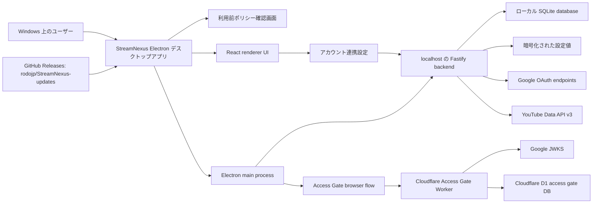
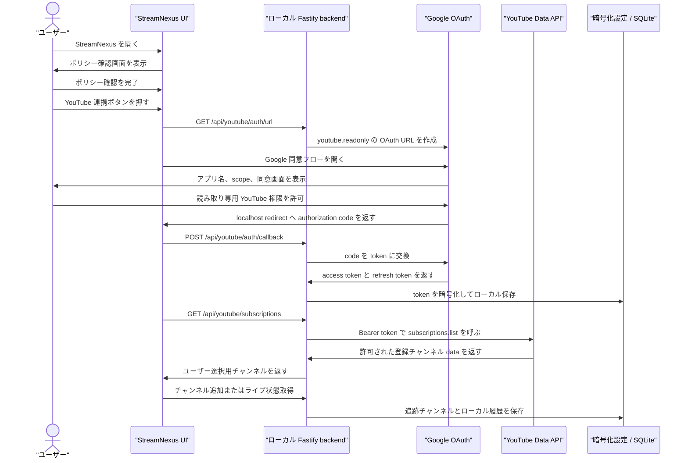
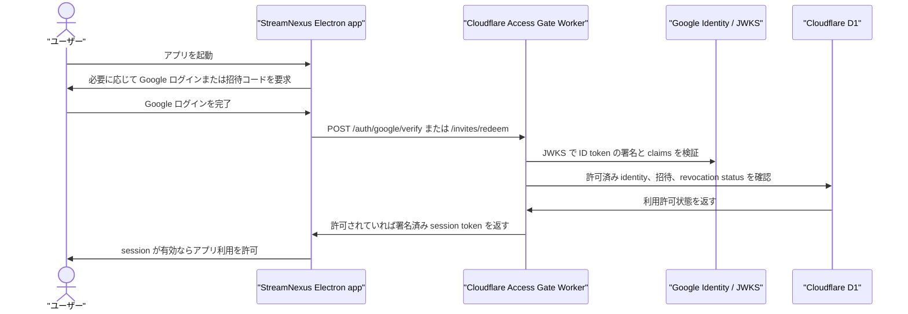
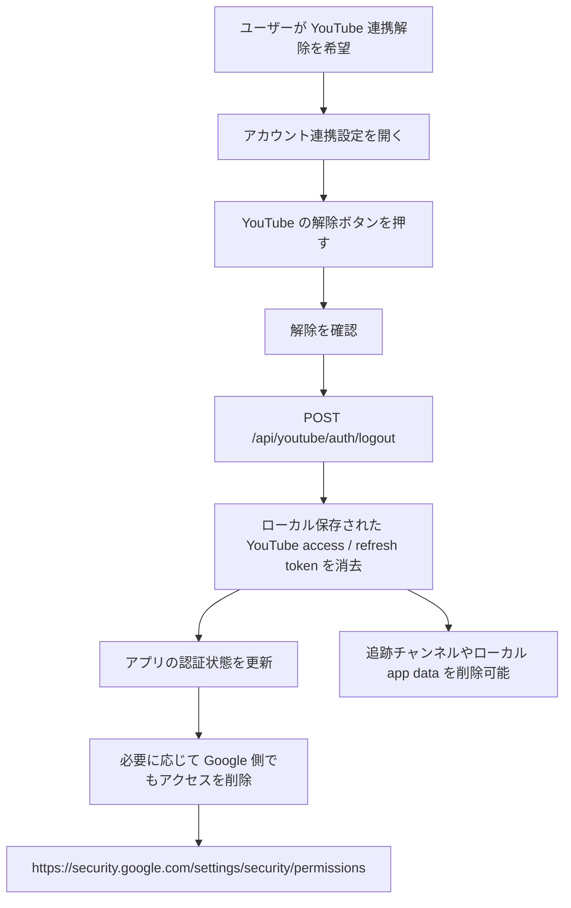

# StreamNexus Google / YouTube コンプライアンス監査向け構成図・ユーザーフロー

最終更新日: 2026-06-02

[English version](./google-compliance-architecture-and-flows.md)

この文書は、Google Cloud OAuth verification および YouTube API Services compliance audit に向けた補足資料です。
StreamNexus の現在のアーキテクチャ、Google / YouTube データフロー、ユーザー同意、取り消し、削除フローをまとめます。

この文書は正式な法務意見ではありません。現在のリポジトリ実装に基づく、技術・コンプライアンス証跡の整理です。

## 1. 公開コンプライアンス URL

- アプリ名: StreamNexus
- ホームページ: <https://github.com/rodojp/StreamNexus-updates>
- リリース: <https://github.com/rodojp/StreamNexus-updates/releases>
- Privacy Policy: <https://github.com/rodojp/StreamNexus-updates/blob/main/privacy-policy.md>
- Terms of Service: <https://github.com/rodojp/StreamNexus-updates/blob/main/terms-of-service.md>
- 日本語プライバシーポリシー: <https://github.com/rodojp/StreamNexus-updates/blob/main/privacy-policy.ja.md>
- 日本語利用規約: <https://github.com/rodojp/StreamNexus-updates/blob/main/terms-of-service.ja.md>

## 2. 参照した公式ポリシー

- Google API Services User Data Policy: <https://developers.google.com/terms/api-services-user-data-policy>
- YouTube API Services Developer Policies: <https://developers.google.com/youtube/terms/developer-policies>
- Complying with YouTube's Developer Policies: <https://developers.google.com/youtube/terms/developer-policies-guide>
- Google OAuth verification requirements: <https://support.google.com/cloud/answer/13464321>
- Submitting an app for OAuth verification: <https://support.google.com/cloud/answer/13461325>
- OAuth app branding: <https://support.google.com/cloud/answer/15549049>

## 3. 対象範囲

StreamNexus は、配信監視、通知、マルチビュー再生を行う Windows デスクトップアプリです。
Google / YouTube 連携は次の 2 系統に分かれます。

- Access Gate: private beta の利用許可確認のため、Google Sign-In / ID token 検証を使う。
- YouTube 連携: ユーザーの登録チャンネル取得と配信監視機能のため、Google OAuth の YouTube 読み取り専用権限を使う。

StreamNexus が要求する YouTube OAuth scope は次のみです。

```text
https://www.googleapis.com/auth/youtube.readonly
```

StreamNexus は YouTube OAuth を使って、動画投稿、動画削除、動画編集、コメント投稿、プレイリスト管理、チャンネル管理を行いません。

## 4. システム構成図



### 構成メモ

- アプリはユーザーの Windows 端末上で動作します。
- backend は Electron アプリに同梱され、localhost で待ち受けます。
- YouTube OAuth token はローカル設定に暗号化して保存します。
- YouTube の追跡チャンネル、配信履歴、アプリ設定はローカル SQLite に保存します。
- Access Gate Worker は YouTube Data API 利用とは別の仕組みです。Google ID token と private beta の利用許可を確認します。
- 配布は `rodojp/StreamNexus-updates` の GitHub Releases を使います。

## 5. データ一覧

| データ分類 | 取得元 | 保存場所 | 目的 | 共有・転送 |
| --- | --- | --- | --- | --- |
| ポリシー確認状態 | アプリ内のユーザー操作 | Electron shared app state と localStorage fallback | ポリシー提示前の利用を防ぐ | 意図的に共有しない |
| Access Gate 用 Google ID token | Google Sign-In | Cloudflare Worker へ送信して検証 | private beta の利用許可確認 | Access Gate Worker で検証 |
| Access Gate identity data | Google ID token claims | Cloudflare D1 | allowlist、招待、利用停止状態の管理 | 広告や販売に使わない |
| YouTube OAuth authorization code | Google OAuth consent | ローカル callback flow で受け渡し | token exchange | ローカル backend と Google token endpoint に送信 |
| YouTube access token | Google OAuth token endpoint | 暗号化されたローカル設定 | YouTube Data API 呼び出し | YouTube API endpoint のみに送信 |
| YouTube refresh token | Google OAuth token endpoint | 暗号化されたローカル設定 | 読み取り専用 access token の更新 | Google OAuth token endpoint のみに送信 |
| YouTube 登録チャンネル | YouTube Data API | UI で利用し、追跡チャンネルとして保存される場合あり | 監視対象チャンネルの追加 | 販売・広告利用しない |
| 追跡 YouTube チャンネル | ユーザー選択 / YouTube metadata | ローカル SQLite | 配信監視、通知、マルチビュー | 意図的に共有しない |
| 公開動画・ライブ metadata | YouTube Data API | ローカル cache / ローカル SQLite 履歴 | ライブ状態、通知、再生リンク、履歴 | 販売・広告利用しない |
| ローカル診断ログ | アプリ実行時 | ローカル app storage / logs | トラブルシュートと安定性確認 | ユーザーが提供した場合のみ共有 |

## 6. OAuth 同意と YouTube データフロー



## 7. Access Gate フロー



Access Gate はアプリ利用許可の制御です。
YouTube OAuth とは別であり、Access Gate だけでは StreamNexus に YouTube API Services data へのアクセス権は付与されません。

## 8. 取り消し・削除フロー



現在の実装状態:

- アプリ内の連携解除で、ローカル保存された YouTube OAuth token を消去します。
- Google アカウント側の取り消しページへのリンクをアプリ内に表示しています。
- ユーザーはアプリ内で追跡 YouTube チャンネルを削除できます。
- すべてのローカル StreamNexus data を消す場合は、Windows のローカル app data 削除が必要です。

最終監査提出前の改善推奨:

- アプリ内 YouTube 連携解除時に、Google token revoke endpoint へ programmatic revoke を行う。
- YouTube 連携解除または削除リクエストに紐づく、ローカル authorized data 削除処理を明確化・実装する。
- 保存済み YouTube authorization がまだ有効かを定期確認し、refresh 不能な場合は関連するローカル YouTube API data を削除する。

## 9. 撮影すべき画面

Google 同意画面は、可能なら表示言語を English にして撮影します。
提出内容と同じ app name、branding、scope 構成が見える必要があります。

必要な証跡:

- StreamNexus の利用前ポリシー確認画面。
- YouTube 連携・解除ボタンが見えるアカウント連携設定画面。
- `StreamNexus` が表示された Google OAuth consent screen。
- YouTube 読み取り専用権限だけが見える、展開済み scope 詳細。
- requested scope を使う機能、たとえば登録チャンネル取得やチャンネル選択。
- アプリ内 YouTube 連携解除の確認画面と完了状態。
- Google のサードパーティ製アプリとサービス画面で StreamNexus のアクセス権を削除できる状態。

## 10. 証跡対応表

| 要件領域 | 現在の証跡 | 状態 |
| --- | --- | --- |
| 公開 homepage | `rodojp/StreamNexus-updates` README | 準備済み |
| 公開 privacy policy | `privacy-policy.md` と日本語版 | レビュー可能 |
| Terms of Service | `terms-of-service.md` と日本語版 | レビュー可能 |
| Google Privacy Policy link | Privacy Policy、Terms、policy screen、settings screen | 準備済み |
| YouTube Terms link | Privacy Policy と Terms | 準備済み |
| 利用前ポリシー確認 | 初回 setup / account linking より前の `PolicyConsentScreen` | 準備済み |
| 最小 OAuth scope | `youtube.readonly` のみ | 準備済み |
| OAuth demo 証跡 | production 設定で screenshot / video 撮影が必要 | 未完了 |
| アプリ内 revoke 導線 | ローカル token clear は存在 | Google token revoke の改善が必要 |
| Authorized data deletion | 手動・ローカル削除手段は存在 | アプリ内削除 workflow の明確化が必要 |
| Access Gate architecture | Cloudflare Worker、Google JWKS、D1 allowlist | 補足説明可能 |
