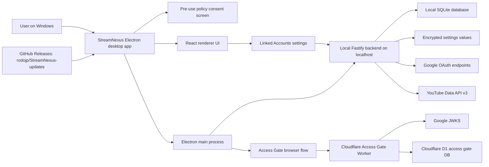
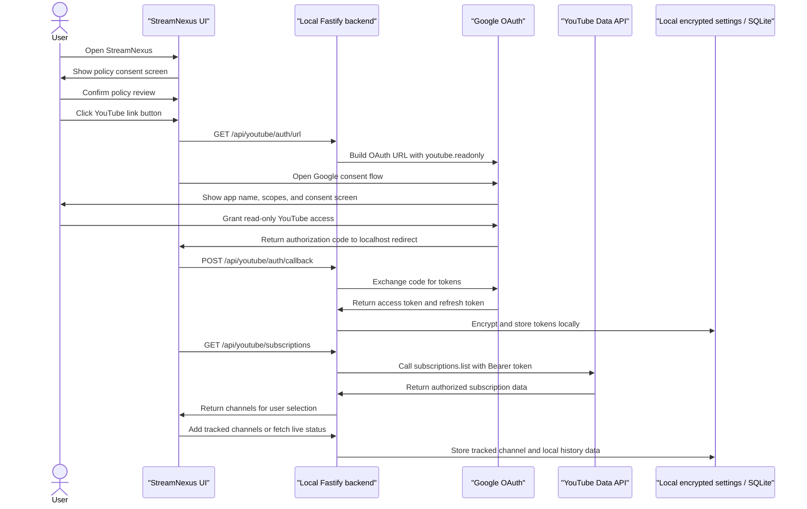
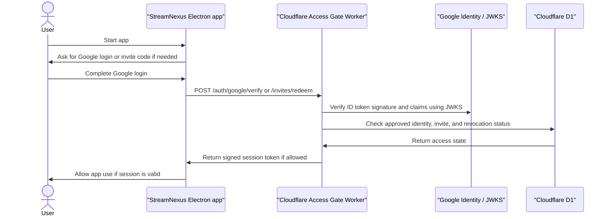
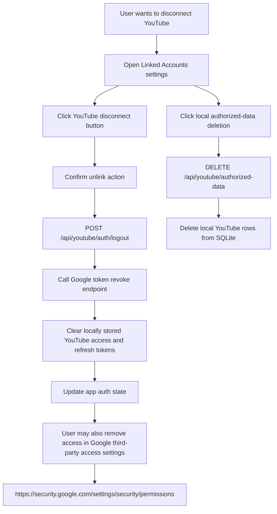

# StreamNexus Google / YouTube Compliance Architecture and User Flows

Last updated: 2026-06-04

[日本語版はこちら / Japanese translation](./google-compliance-architecture-and-flows.ja.md)

This document is prepared as supporting evidence for Google Cloud OAuth verification and YouTube API Services compliance review.
It describes the current StreamNexus architecture, Google / YouTube data flows, user consent flow, revocation flow, and data deletion flow.

This document is not legal advice. It is an engineering and compliance evidence summary based on the current repository.

## 1. Public Compliance URLs

- App name: StreamNexus
- Homepage: <https://github.com/rodojp/StreamNexus-updates>
- Releases: <https://github.com/rodojp/StreamNexus-updates/releases>
- Privacy Policy: <https://github.com/rodojp/StreamNexus-updates/blob/main/privacy-policy.md>
- Terms of Service: <https://github.com/rodojp/StreamNexus-updates/blob/main/terms-of-service.md>
- Japanese Privacy Policy: <https://github.com/rodojp/StreamNexus-updates/blob/main/privacy-policy.ja.md>
- Japanese Terms of Service: <https://github.com/rodojp/StreamNexus-updates/blob/main/terms-of-service.ja.md>

## 2. Official Policy References

The review package is aligned against these official Google / YouTube references:

- Google API Services User Data Policy: <https://developers.google.com/terms/api-services-user-data-policy>
- YouTube API Services Developer Policies: <https://developers.google.com/youtube/terms/developer-policies>
- Complying with YouTube's Developer Policies: <https://developers.google.com/youtube/terms/developer-policies-guide>
- Google OAuth verification requirements: <https://support.google.com/cloud/answer/13464321>
- Submitting an app for OAuth verification: <https://support.google.com/cloud/answer/13461325>
- OAuth app branding: <https://support.google.com/cloud/answer/15549049>
- OAuth 2.0 for iOS and desktop apps: <https://developers.google.com/identity/protocols/oauth2/native-app>

## 3. Scope Summary

StreamNexus is a Windows desktop app for stream monitoring, notifications, and multiview playback.
The app uses Google / YouTube in two distinct ways:

- Access Gate: Google Sign-In / ID token verification is used to confirm whether a private-beta user is allowed to open the app.
- YouTube integration: Google OAuth is used to obtain a YouTube read-only authorization for the user's subscriptions and related stream monitoring features.

The YouTube OAuth scope requested by StreamNexus is:

```text
https://www.googleapis.com/auth/youtube.readonly
```

StreamNexus does not use YouTube OAuth to upload, delete, edit, comment on, or manage YouTube videos, playlists, channels, or comments.

## 4. System Architecture

Raster diagram assets for submission attachments:

- [Architecture diagram PNG](./assets/google-compliance/streamnexus-architecture.png)
- [Architecture diagram JPEG](./assets/google-compliance/streamnexus-architecture.jpg)



### Architecture Notes

- The app runs locally on the user's Windows machine.
- The backend is bundled with the Electron app and listens on localhost.
- YouTube OAuth tokens are stored locally in encrypted settings.
- YouTube tracked channels, stream history, and app preferences are stored locally in SQLite.
- The access gate worker is separate from YouTube Data API usage. It verifies Google ID tokens and private-beta access status.
- Release distribution uses GitHub Releases in `rodojp/StreamNexus-updates`.

## 5. Data Inventory

| Data category | Source | Stored where | Purpose | Sharing / transfer |
| --- | --- | --- | --- | --- |
| Policy consent state | User action in app | Electron shared app state and localStorage fallback | Blocks app use until policies are shown | Not intentionally shared |
| Google ID token for access gate | Google Sign-In | Sent to Cloudflare Worker for verification | Private-beta access confirmation | Verified by Access Gate Worker |
| Access gate identity data | Google ID token claims | Cloudflare D1 | Allowlist, invitation, and access status | Not sold or used for advertising |
| YouTube OAuth authorization code | Google OAuth consent | Passed through local callback flow | Token exchange | Sent to local backend and Google token endpoint |
| YouTube access token | Google OAuth token endpoint | Encrypted local settings | Call YouTube Data API while valid | Sent only to YouTube API endpoints |
| YouTube refresh token | Google OAuth token endpoint | Encrypted local settings | Refresh read-only YouTube access | Sent only to Google OAuth token endpoint |
| YouTube subscriptions | YouTube Data API | Used by UI, may be represented as tracked channels | Let the user add monitored channels | Not sold or used for advertising |
| Tracked YouTube channels | User selection / YouTube metadata | Local SQLite | Stream monitoring, notifications, multiview | Not intentionally shared |
| Public video and live metadata | YouTube Data API | Local cache / local SQLite history | Live status, notifications, playback links, history | Not sold or used for advertising |
| Local diagnostic logs | App runtime | Local app storage / logs | Troubleshooting and stability review | Shared only when the user chooses to provide logs |

## 6. OAuth Consent and YouTube Data Flow

Raster flow assets:

- [OAuth user flow PNG](./assets/google-compliance/streamnexus-user-flow.png)
- [OAuth user flow JPEG](./assets/google-compliance/streamnexus-user-flow.jpg)



## 7. Access Gate Flow



Access Gate is an app access control mechanism.
It is separate from YouTube OAuth and does not grant StreamNexus access to YouTube API Services data.

## 8. Revocation and Deletion Flow

Raster flow assets:

- [Revocation and deletion flow PNG](./assets/google-compliance/streamnexus-revocation-deletion-flow.png)
- [Revocation and deletion flow JPEG](./assets/google-compliance/streamnexus-revocation-deletion-flow.jpg)



Current implementation status:

- In-app disconnect calls Google token revocation before clearing locally stored YouTube OAuth tokens.
- If revocation fails because of a network or server error, local tokens are kept so the user can retry revocation.
- The local authorized-data deletion action revokes any remaining token, clears local tokens, and deletes YouTube rows from local SQLite.
- Local deletion covers `tracked_channels`, `stream_history`, `watch_sessions`, `stream_notes`, and `claim_history` rows where `platform = 'youtube'`.
- The app links users to Google's third-party access page for account-side revocation.
- Users can remove tracked YouTube channels from the app.
- Users can remove all local StreamNexus data by deleting local app data from Windows.

Compliance follow-up before final audit submission:

- Capture screenshots and demo video showing the implemented revocation and local deletion controls.
- Add periodic confirmation for stored YouTube authorization validity and clean up local YouTube API data when authorization cannot be refreshed.

## 9. User-Facing Screens to Capture

Use English UI language for the Google consent screen when possible.
Screenshots or video should show the exact same app name, branding, and scope configuration submitted to Google.

Required evidence:

- Pre-use policy consent screen in StreamNexus.
- Linked Accounts settings with YouTube link and disconnect controls.
- Google OAuth consent screen showing `StreamNexus`.
- Expanded scope details showing only YouTube read-only access.
- YouTube integration behavior that uses the requested scope, for example subscription import or channel selection.
- In-app YouTube disconnect confirmation and result.
- Google third-party app access page where StreamNexus access can be removed.

## 10. Evidence Mapping

| Requirement area | Current evidence | Current status |
| --- | --- | --- |
| Public homepage | `rodojp/StreamNexus-updates` README | Ready |
| Public privacy policy | `privacy-policy.md` and Japanese translation | Ready for review |
| Terms of Service | `terms-of-service.md` and Japanese translation | Ready for review |
| Google Privacy Policy link | Privacy Policy, Terms, policy screen, settings screen | Ready |
| YouTube Terms link | Privacy Policy and Terms | Ready |
| Before-use policy confirmation | `PolicyConsentScreen` before initial setup and account linking | Ready |
| Minimum OAuth scope | `youtube.readonly` only | Ready |
| OAuth demo evidence | Needs screenshots / video captured from production configuration | Pending |
| In-app revocation route | `POST /api/youtube/auth/logout` calls Google token revoke endpoint | Implemented, needs screenshot/demo evidence |
| Authorized data deletion | `DELETE /api/youtube/authorized-data` deletes local YouTube rows | Implemented, needs screenshot/demo evidence |
| Access gate architecture | Cloudflare Worker, Google JWKS, D1 allowlist | Ready for supplemental explanation |
